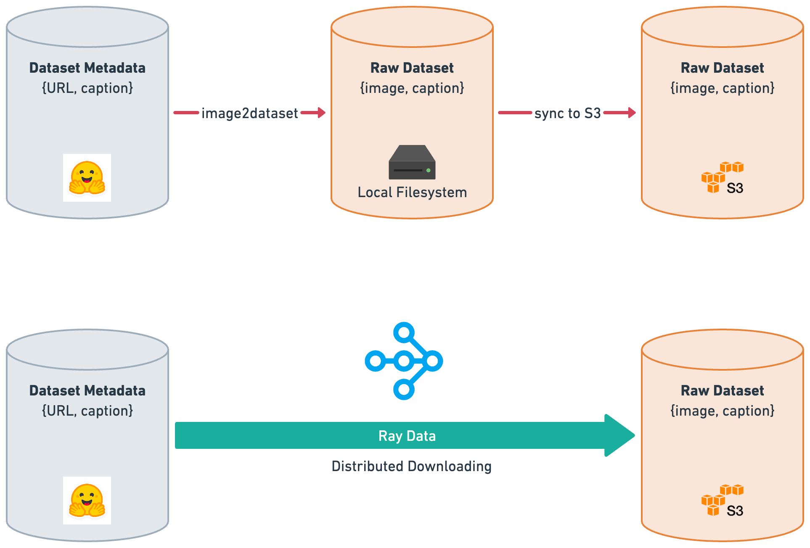
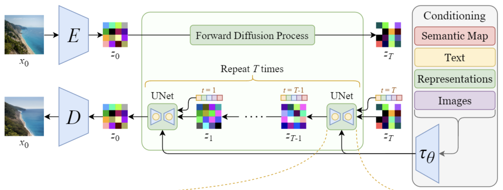
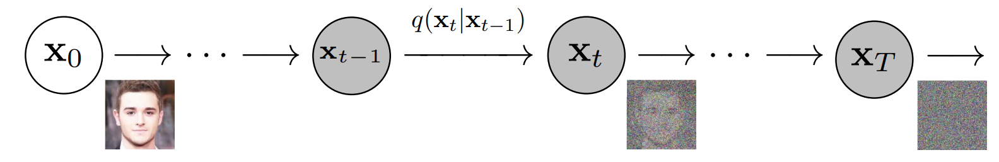
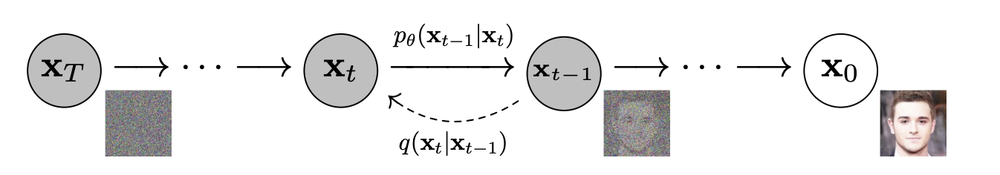
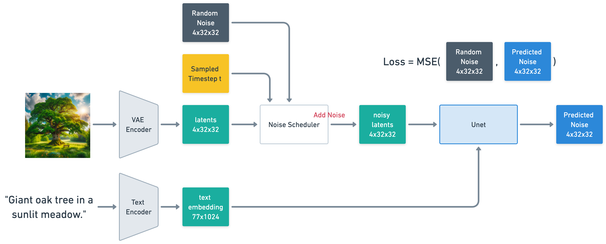
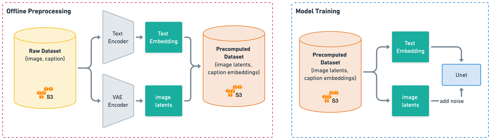
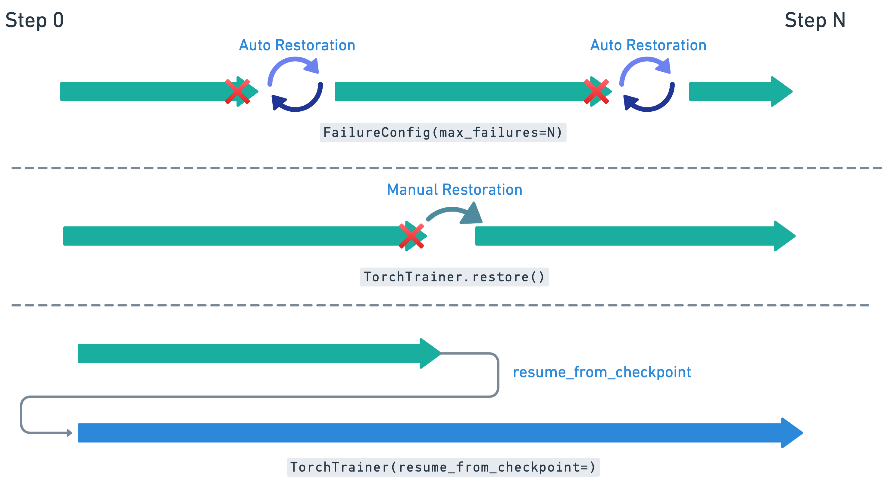
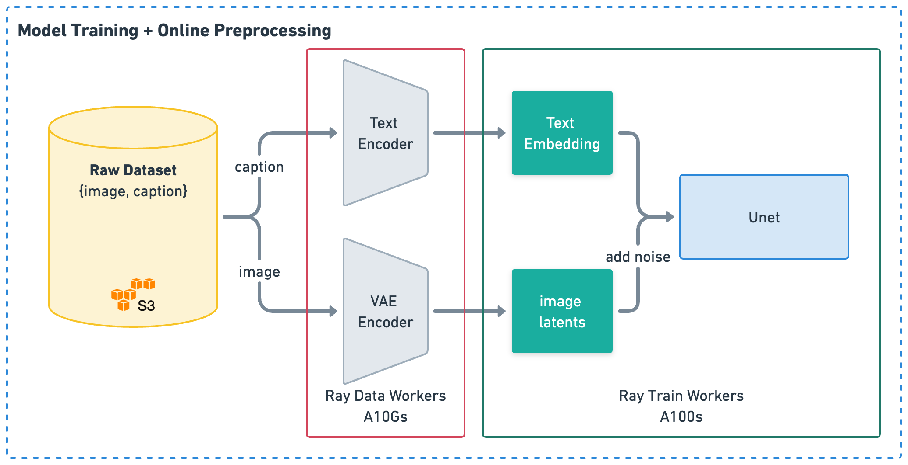

# Ray Train & PyTorch Lightning: Pretraining Stable Diffusion Models

## Overview

This codebase demonstrates how to use Ray Train and PyTorch Lightning to pretrain a stable diffusion(base and XL) model from scratch. In this user guide, we will go through an end-to-end procedure to help you sucuessfully launch a pretraining job.

### Contents:
- [Environment Setup](#environment-setup)
- [Download LAION Dataset](#download-laion-dataset)
- [Stable Diffusion](#stable-diffusion-training)
  - [Training Procedure](#training-procedure)
  - [Offline Data Preprocessing](#offline-data-preprocessing)
  - [Fault-tolerant Training](#fault-tolerant-training)
- [Stable Diffusion XL](#stable-diffusion-xl)
  - [Training Procedure](#training-procedure-1)
  - [Online Data Preprocessing](#online-data-preprocessing)

## Environment Setup

Here are the system and software settings for stable diffusion pretraining: 

**Cluster setting:**

For model training, we conducted experiments using 2 x `p4d.24xlarge` instances on AWS, each equipped with 8 Nvidia A100-40G GPUs and an Elastic Fabric Adapter (EFA) setup. EFA is now automatically supported on Anyscale.

For data preprocessing, we also leveraged some other instance types (e.g. `g5.4xlarge`, `m5.8xlarge`).


**Cloud Storage:**

Your training data, model checkpoints, and training artifacts are stored in an S3 bucket. Please create an S3 bucket and make sure you can read and write to it from your machines. The out-of-the-box solution provided by the Anyscale platform is `$ANYSCALE_ARTIFACT_STORAGE`.

**Dependencies:**

To get started, please install the required Python packages into your base environment. We recommend using Python 3.9 and CUDA 11.8 for compatibility:

```
pip install -r requirements.txt
```

For Anyscale users, you can create your custom runtime environment based on the `anyscale/ray-ml:nightly-py39-gpu` base image, and install the necessary Python packages listed in `requirements.txt`.

**Experiment Tracking:**

This repository uses Wandb for experiment tracking. Find your api key in the Wandb portal and export it as an environment variable:
```
export WANDB_API_KEY=...
```

## Download LAION Dataset

In this section, we will leverage Ray Data to download the raw [LAION dataset](https://laion.ai/blog/laion-5b/), and persist it into an S3 bucket.

LAION is a large-scale, open-source collection of image-text pairs used for training machine learning models. It features billions of web-scraped images paired with descriptive texts, aiding in the development of advanced image generation models including Stable Diffusion.

> **Note**:
> Here we take [`laion-aesthetic`](https://huggingface.co/datasets/laion/laion2B-en-aesthetic) as an example, you can also switch to other LAION subsets. Please refer to the [HF LAION dataset list](https://huggingface.co/laion?search_datasets=laion) for more details.

Each raw sample of LAION contains an image URL, text caption, and additional metadata. Command line tools like [img2datasets](https://github.com/rom1504/img2dataset) that can help you download the image content from the url. However, img2dataset can only save files to a local machine, and it require the user to set up the PySpark cluster to enable distributed downloading.

Instead, Ray Data provides an efficient and cloud-friendly way to distribute download workloads in a ray cluster, and stream raw datasets directly to S3.



```
python download_laion.py --dataset_name laion-aesthetic-120M --output_uri $RAW_DATA_S3_URI
```

It takes 10 hours to download the `laion-aesthetic-120M` Dataset with 10 x m5.8xlarge (32 CPUs, 128 GB Memory each). You can adjust the number of nodes in the Ray Cluster to further speed up data downloads.

The raw dataset will be stored at the location specified by `$RAW_DATA_S3_URI`. It is organized as a series of Parquet files with the following schema:
```
{
  similarity: double,
  hash: int64,
  punsafe: float,
  pwatermark: float,
  aesthetic: float,
  url: string,
  caption: string,
  height: int32,
  width: int32,
  jpg: binary,
  error_msg: string
}
```

> **Note**:
> Here we take [`laion-aesthetic`](https://github.com/LAION-AI/laion-datasets/blob/main/laion-aesthetic.md) as an example, you can also switch to other LAION subsets. Please refer to the [HF LAION dataset list](https://huggingface.co/laion) for more details.

## Stable Diffusion Training

<!-- 
Figure: Overview of stable diffusion model architecture. [[link]](https://medium.com/@steinsfu/stable-diffusion-clearly-explained-ed008044e07e) -->



**Figure 1: The forward and reverse process of an unconditional diffusion model.**

The diffusion model starts with a real image, and gradually adds noise to it over a series of steps, until the data becomes a sample of pure noise. The key part of a diffusion model is learning how to reverse this process. The model is trained to predict the noise that was added at each step and then remove it, effectively learning how to generate a coherent image from random noise.


**Figure 2: The data flow of Diffusion model training**


More speficially, we are trying to train the Unet to fit the conditional probability $p_\theta(x_{t-1}|x_t)$ of the reverse process. In practice, the Unet predicts the noise added to the image. According to [Denoising Diffusion Probabilistic Models](https://arxiv.org/pdf/2006.11239.pdf), we use a simplified training objective to minimize the mean square error between the random noise and the predicted noise.


### Offline Data Preprocessing
In this section, we will discuss how to do offline preprocessing with Ray Data, to precompute the image latents and representations of text caption.



**Figure 3: Illustration of Offline Preprocessing**

During pre-training, we freeze the VAE and text encoder and only train Unet. Precomputing image latent values and text embeddings will reduce GRAM usage during training, thereby increasing overall training throughput.

Suppose we have 16 x `g5.4xlarge` instances for preprocessing. Now run the following command to process and encode images:
```
# SD, resolution 256x256
python offline_preprocess.py --resolution 256 --num_gpu 16 --raw_data_uri $RAW_DATA_S3_URI --output_uri $PROCESSED_DATA_S3_URI

# SD, resolution 512x512
python offline_preprocess.py --resolution 512 --num_gpu 16 --raw_data_uri $RAW_DATA_S3_URI --output_uri $PROCESSED_DATA_S3_URI
```

The throughput of the offline preprocessing is as below:
- Resolution 256x256: 1200 images/s
- Resolution 512x512: 400 images/s 

To increase the throughput, you can add more GPU nodes in your Ray cluster and adjust `--num_gpus` accordingly.

Now we've preprocessed the raw dataset, the output dataset will be saved under `$PROCESSED_DATA_S3_URI`. You can split the dataset into train and validation sets at will. 

### Training Procedure

Stable Diffusion base model includes 3 components: An Image autoencoder, a text encoder and a Unet. During pretraining, we freeze the **VAE** and **Text Encoder**, and only unfreeze and train the **Unet** parameters.

```
  | Name         | Type                 | Params
------------------------------------------------------
0 | unet         | UNet2DConditionModel | 865 M       <- Trainable
1 | vae          | AutoencoderKL        | 83.7 M      <- Frozen
2 | text_encoder | CLIPTextModel        | 340 M       <- Frozen
------------------------------------------------------
```

<details>
  <summary> Expand for details</summary>
  
  **Text Encoder**: The text encoder converts the input prompts into an embedding space as conditional input to U-Net. This serves as a guide to noise latents when we train Unet's denoising process. A text encoder is typically a pretrained transformer-based encoder that maps a sequence of input tokens to a sequence of latent text embeddings. Stable Diffusion does not train a new text encoder, but uses the already trained text encoder CLIP. We also use CLIP text encoder in our code base, but you can switch it to any other text encoders.

**VAE**: The VAE model has two parts, an encoder and a decoder. During latent diffusion training, the encoder converts a high-dimensional image into a low dimensional latent representation for the forward diffusion process. These small encoded versions of images are referred as latents. We apply noise to these latents at each step of training, which acts as the input to the U-Net model.

- Encoding: VAE converts an image of shape (3, 256, 256) / (3, 512, 512) into a latent of shape (4, 32, 32) / (4, 64, 64), which requires 48 times less memory. This leads to reduced memory and compute requirements compared to pixel-space diffusion models.
- Decoding: The decoder transforms the latent representation back into an image. During inference, VAE decode the denoised latents generated by the reverse diffusion process into images.

**Unet**: Unet predicts denoised image representations of noise latency. Specifically, Unet takes as input the noise latents (x), the timestep (t), and the caption text embeddings as guidance to predict the noise at the current timestep.
</details>

As reported by CompVis, there are 2 phases for [stable-diffusion-2-1](https://huggingface.co/stabilityai/stable-diffusion-2-1) pretraining. 

**Stage 1**:
- Dataset: [`LAION-5B`](https://huggingface.co/datasets/laion/laion2B-en) filtered NSFW content.
- 550,000 steps 
- Batch size: 2048
- Resolution: 256x256.
```
python train.py --config config/sd/sd_256.json
```

**Stage 2**:
- Dataset: The same dataset as above
- 850,000 steps
- Batch size: 2048
- Resolution: 512x512

```
python train.py \
  --config config/sd/sd_512.json \
  --resume_from_checkpoint $LATEST_CHECKPOINT_URI_OF_STAGE_1
```

> **Note:** We followed the above training schedule in our experiments, you may want to configure the hyperparameters differently depending on your resource and training data.

**Training details:**
- Hardware: 2 x 8 x A100-40GB GPUs
- Optimizer: AdamW
- Gradient Accumulations: 4
- Micro batch size: 32 
- Batch size: 2 x 8 x 4 x 32 = 2048
- Learning rate: warmup to 0.0001 for 10,000 steps and then kept constant

In the `config/sd/base_256.json` file, we have the following initial configuration:
```
{
  "num_workers": 16,
  "batch_size_per_worker": 32,
  "global_batch_size": 2048,
  "accumulate_grad_batches": 4
}
```

If you have more A100 GPUs for training, you can adjust the training parameters accordingly.

### Benchmark

We conducted benchmark experiments on 16 A100 GPUs and with a global batch size of 2048. Below are the detailed results of the training throughput compared with MosaicML's results:

Input Image Size | Hardware | MosaicML Throughput (images/s) | Anyscale Throughput (images/s)
-- | -- | -- | --
256 x 256 | 16 x A100-40G | 2180  | 2872 **(1.32x)**
512 x 512 | 16 x A100-40G | 585 | 795 **(1.36x)**


Our training throughput achieved over **1.3x** throughput improvements over [MosaicML's results](https://www.mosaicml.com/blog/diffusion) for  images of resolution 256x256 and 512x512. For more details on throughput optimization, see [this doc](resources/benchmark.md). With 16 A100s, you should be able to pretrain a SD-base model in 30 days.

## Fault-tolerant Training



Stable diffusion pretraining is a long-running distributed workload, which means failures can occur. Generally, failures can be classified into two classes: 1) application-level failures, and 2) system-level failures. The former can happen because of bugs in user-level code, or if external systems fail. The latter can be triggered on other senarios, such as spot preemption, node failures, network failures. Ray Train provides the capability to safely recover from these failures.


Upon restoration, Ray Train retrieves the latest checkpoint and initiates the predefined restoration process in the training function. The procedures will be:
- Read the Ray Dataset from the beginning, with a global shuffle.
- Sync the latest checkpoint file from cloud storage to local filesystem.
- Resume training with the latest ckpt with `pl.Trainer.fit(..., ckpt_path=)`. 

### Automatic Restoration: 

Specify `--max_failures N` to enable auto-restoration, which will try to relaunch the training for N times before job termination. This is useful when you are using spot instances and want to ignore the spot preemption.

```
# Enable auto-restoration: Retry up to 4 times on crash.
python train.py \
  --config config.json \
  --max_failures 4
```

### Manual Restoration: 

The Ray Train artifacts are stored with the following directory structure:

```
s3://bucket-name/sub-path (RunConfig.storage_path)
└── experiment_name (RunConfig.name)          <- The "experiment directory"
    ├── experiment_state-*.json
    ├── basic-variant-state-*.json
    ├── trainer.pkl
    ├── tuner.pkl
    └── TorchTrainer_46367_00000_0_...        <- The "trial directory"
        ├── events.out.tfevents...            <- Tensorboard logs of reported metrics
        ├── result.json                       <- JSON log file of reported metrics
        ├── checkpoint_000000/                <- Checkpoints
        ├── checkpoint_000001/
        ├── ...
        ├── checkpoint_000008/
        ├── artifact-rank=0-iter=0.txt        <- Worker artifacts (see the next section)
        ├── artifact-rank=1-iter=0.txt
        └── ...
```

**Resume an existing trial**: If you want to resume training with the same configuration, you can manually resume training by `--restore_from_uri $EXPERIMENT_DIRECTORY_URI`. The checkpoint index will continue to grow based on the existing index (here `000009`).

```
# Resuming from a crashed experiment
python train.py \
  --config original_config.json \
  --restore_from_uri s3://{storage_path}/{experiment_name}/
```

**Start a new trial**: You may want to resume training from a previously saved checkpoint, but with a different training configuration. You can resume training using the `--resume_from_checkpoint` argument.

```
# Kickoff a new experiment from the 8th checkpoint
python train.py \
  --config new_config.json \
  --resume_from_checkpoint s3://{storage_path}/{experiment_name}/TorchTrainer_46367_00000_0_.../checkpoint_000008/
```

In this example, you are creating a new Ray Train trial, and load the `checkpoint_000008` from an existing trial. The checkpoint index of the new trial will grow from `000000`.

> Reference: [Ray Train User Guide: Handling Failures and Node Preemption](https://docs.ray.io/en/latest/train/user-guides/fault-tolerance.html)

## Stable Diffusion XL

```
  | Name           | Type                        | Params
---------------------------------------------------------------
0 | text_encoder   | CLIPTextModel               | 123 M 
1 | text_encoder_2 | CLIPTextModelWithProjection | 694 M 
2 | unet           | UNet2DConditionModel        | 2.6 B 
3 | vae            | AutoencoderKL               | 83.7 M
---------------------------------------------------------------
```

Compared with SD, SDXL has a larger UNet module, 3x larger than SD, and combines two text encoders (OpenCLIP ViT-bigG/14 and the original text encoder), significantly increasing the number of parameters.

Even if we precompute embeddings and train Unet using bf16 mixed precision, the minimum GPU memory requirement excluding activations and buffers is still:

```
(2 (params) + 2 (gradients) + 3 x 4 (AdamW optimizer states)) *  2.6 B = 41.6 GB
```

which cannot fit into a single A100-40G GPU. Here we choose to use FSDP for SDXL pretraining, which shards parameters, optimizers, gradients across the workers to reduce GPU memory consumption. More details in this [Benchmark SDXL doc](resources/benchmark-sdxl.md) for more details on how to tune FSDP config.


In addition to the larger model size, SDXL also utilized new training techniques including size- and crop-conditioning and multi-aspect training, which allows for better control over image cropping and generate images with higher quality. More details in this [SDXL technical report](https://arxiv.org/pdf/2307.01952.pdf).

### Online Data Preprocessing



In this repo, we utilize Ray Data to facilitate online data preprocessing by leveraging heterogeneous resources, allocating A100s for training and other GPUs like the A10G for data processing. 

For example, launch a cluster with 
- 2 x `p4d.24xlarge` (Model Training)
- 16 x `g5.4xlarge` (Online Data Preprocessing) 

Turn on the `--online_preprocessing` flag and specify the raw dataset URIs for `train.py`. This methodology effectively minimized GPU memory consumption on A100 units, enabling increased micro batch sizes during Unet training. Additionally, it enabled random cropping that is required for size- and crop-conditioning techniques.

### Training Procedure

According to the technical report, the SDXL-base model was pretrained in a multi-stage procedure:

**Stage 1**:
- 600,000 steps on an internal dataset. 
- Fixed Resolution: 256x256
- Batch Size: 2048
- Use size- and crop-conditioning

**Stage 2**:
- 200,000 steps on an internal dataset. 
- Fixed Resolution: 512x512
- Use size- and crop-conditioning

**Stage 3**:

- Multi-aspect training with offset-noise

In this repo, we applied FSDP to shard the model, gradients, and optimizer state across multiple GPUs to reduce memory consumption. We've put our tuned configurations under `./config/sdxl/` folder. 

### Put everything together 

```
# Stage 1
python train.py \
  --config config/sdxl/sdxl_256.json \
  --online_preprocessing \
  --train_data_uri $RAW_TRAIN_DATA_S3_URI \
  --validation_data_uri $RAW_VALIDATION_DATA_S3_URI \
  --num_encoders 16
```

Then, kick-off training at 512x512 resolution by running:
```
# Stage 2
python train.py \
  --config config/sdxl/sdxl_512.json \
  --online_preprocessing \
  --train_data_uri $RAW_TRAIN_DATA_S3_URI \
  --validation_data_uri $RAW_VALIDATION_DATA_S3_URI \
  --num_encoders 16 \
  --resume_from_checkpoint $LATEST_CHECKPOINT_URI_OF_STAGE_1
 
# Stage 3 (TODO)
```

In this setup, Ray Data uses 16 A10G GPUs for efficient online preprocessing and pipelines it with model training. The training throughput is comparable to loading offline precomputed datasets.

Resolution | Strategy | micro batch size | Global Throughput (images/s)
-- | -- | -- | --
256 x 256 | FSDP HYBRID_SHRAD, min_num_params=1e7 | 32 | 307.0
512 x 512 | FSDP HYBRID_SHRAD, min_num_params=1e7, activation checkpointing | 32 | 163.8

# Future works
- SDXL Multi-Aspect Training
- Tune FSDP configuration automatically 
