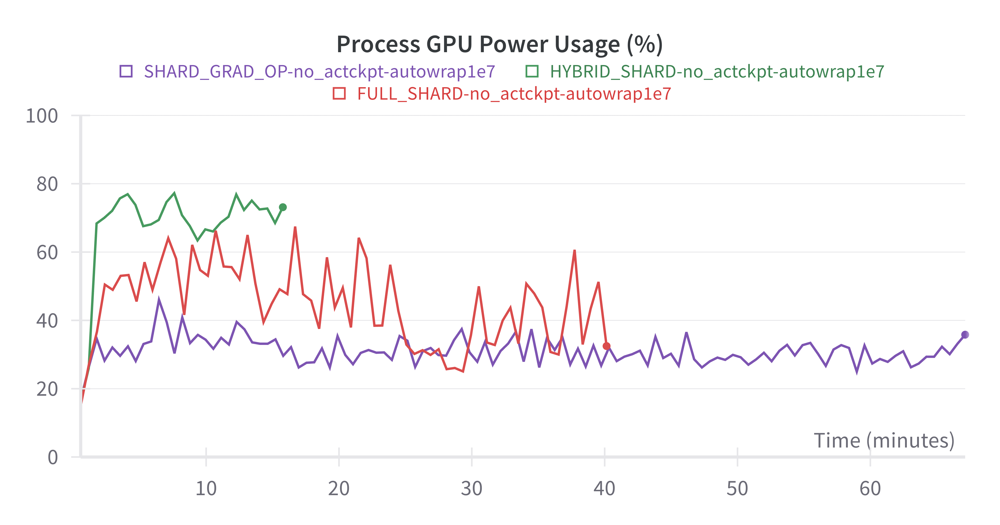

# SDXL Throughput Benchmark

## Overview
```
  | Name           | Type                        | Params
---------------------------------------------------------------
0 | text_encoder   | CLIPTextModel               | 123 M 
1 | text_encoder_2 | CLIPTextModelWithProjection | 694 M 
2 | unet           | UNet2DConditionModel        | 2.6 B 
3 | vae            | AutoencoderKL               | 83.7 M
---------------------------------------------------------------
```

SDXL has 3 times more parameters than the stable diffusion base. Even if we precompute embeddings and train Unet using bf16 mixed precision, the minimum GPU memory requirement excluding activations and buffers is still:

```
(2 (params) + 2 (gradients) + 3 x 4 (AdamW optimizer states)) *  2.6 B = 41.6 GB
```

which cannot fit into a single A100-40G GPU. Here, we propose using FSDP to shard the model, gradients, and optimizer state across multiple GPUs to reduce memory consumption.

PyTorch FSDP has a lot of knobs that need to be adjusted and can significantly affect training throughput, we discussed the 3 main knobs below (sharding strategy, wrapping strategy, and activation checkpointing). 

All the experiments below are conducted with 2 x `p4d.24xlarge` instances. Note that the optimal combination of hyperparameters is highly dependent on your cluster setup (num_node, num_gpus_per_node, gpu type, ...). Users need to tune the best hyperparameters for their own cluster settings. 

### 1. Sharding Policy

FSDP has different sharding policies that controls whether to shard model parameters, gradients, optimizer states, or a combination of them.
- `NO_SHARD`(DDP): No sharding
- `SHARD_GRAD_OP` (ZeRO-2): Shards gradients and optimizer states only. Model parameters get replicated.
- `FULL_SHARD` (ZeRO-3): Shards model parameters, gradients, and optimizer states (default).
- `HYBRID_SHARD` (ZeRO-3 within a single node, DDP across multiple nodes): Shards model parameters, gradients, and optimizer states within a single machine, but replicates across machines.

**Setting: 512x512, auto_wrap_policy(min_num_params=1e7), no activation checkpointing**

| Sharding Policy | per_device_batch_size | it/s | Throughput (images/s) |
| --------------- | --------------------- | ---- | --------------------- |
|NO_SHARD         | OOM                   | OOM  |                   OOM |
|SHARD_GRAD_OP    | 8                     | 1.00 |                 128.0 |
|FULL_SHARD       | 8                     | 0.85 |                 108.8 |
|HYBRID_SHARD     | 8                     | 1.02 |                 130.6 |

From the experiment above, we see that the FULL_SHARD policy has the lowest throughput because it incurs the largest communication overhead. HYBRID_SHARD reduces inter-node communication, while SHARD_GRAD_OP does not require model parameter synchronization, allowing both to achieve higher global throughput.

We also explored the maximum batch size for each sharding policy:

| Sharding Policy | Max per device batch size | it/s  | Throughput (images/s) |
| --------------- | ------------------------- | ----  | --------------------- |
|NO_SHARD         |            OOM            |  OOM  |                   OOM |
|SHARD_GRAD_OP    |             9             |  0.30 |                  43.5 |
|FULL_SHARD       |             14            |  0.43 |                  95.1 |
|HYBRID_SHARD     |             11            |  1.10 |                 193.8 |


`HYBRID_SHARD` achieves the highest GPU power consumption and achieves the highest training throughput. It reduces communication traffic since expensive all-gather and reduced-scatter is done only within the node, which can improve performance for medium-sized models like SDXL.

### 2. Wrapping Policy

FSDP decomposes the model instance into smaller units and handles each unit independently. During forward and backward computation, FSDP only materializes unsharded parameters and gradients of one unit at a time, and otherwise, it keeps parameters and gradients sharded. Therefore, the memory requirements for FSDP are proportional to the size of the sharded model plus the size of the largest fully-materialized FSDP unit.

Users can configure customized FSDP wrapping policy. Generally speaking, we want to trade off between throughput (larger batch size) and latency (communication overhead). Smaller FSDP units reduce maximum memory requirements and can accommodate larger batch sizes, but introduce more AllReduce and Reduce-Scatter operations. 

**Setting: 512x512, sharding_policy=HYBRID_SHARD, no activation checkpointing**

| min_num_params | batch_size | it/s | Global Throughput (images/s) |
| -- | -- | -- | -- |
| 1e6 | 8 | 0.40 |  51.2 |
| 1e7 | 8 | 1.12 | 143.36 |
| 1e8 | 8 | 0.24 | 30.72 |


### 3. Activation Checkpointing

Typically, in each forward pass, all the intermediate activations are retained in memory, as they are needed to compute the backward pass. Activation checkpointing is a technique to reduce memory consumption by only retaining a subset of intermediate activations, and recomputing the rest as needed. 

Although activation checkpointing slows down the time it takes to compute one gradient step but reduces activation memory usage, and therefore can support larger effective batch sizes per forward/backward-pass and improve the overall throughput.

| Config | Activation checkpoint | per_device_batch_size | iter/s | Global Throughput (images/s) |
| -------------------------------- | ------- | -- | ---- | ------ |
| HYBRID_SHARD, min_num_params=1e7 | N/A     | 8  | 1.12 | 143.38 |
| HYBRID_SHARD, min_num_params=1e7 | enabled | 8  | 0.41 | 56.32  |
| HYBRID_SHARD, min_num_params=1e7 | enabled | 16 | 0.40 | 102.40 |
| HYBRID_SHARD, min_num_params=1e7 | enabled | 24 | 0.36 | 138.24 |
| HYBRID_SHARD, min_num_params=1e7 | enabled | 32 | 0.32 | 163.84 |
| HYBRID_SHARD, min_num_params=1e7 | enabled | 40 | OOM  | OOM    |

There are also other configurations(e.g. `backward_prefetch`, `forward_prefetch`, `cpu_offload`, ...) to tune, we didn't cover it in this user guide. Please refer to [Pytorch FSDP maunal](https://pytorch.org/docs/stable/fsdp.html) for more details.


### Final Results:
Resolution | Strategy | micro batch size | Global Throughput (images/s)
-- | -- | -- | --
256 x 256 | FSDP HYBRID_SHRAD, min_num_params=1e7 | 32 | 307.0
512 x 512 | FSDP HYBRID_SHRAD, min_num_params=1e7, activation checkpointing | 32 | 163.8

> Note that the optimal configuration for FSDP varies with each cluster. It's crucial to tailor the settings for your specific cluster settings to achieve higher throughput.