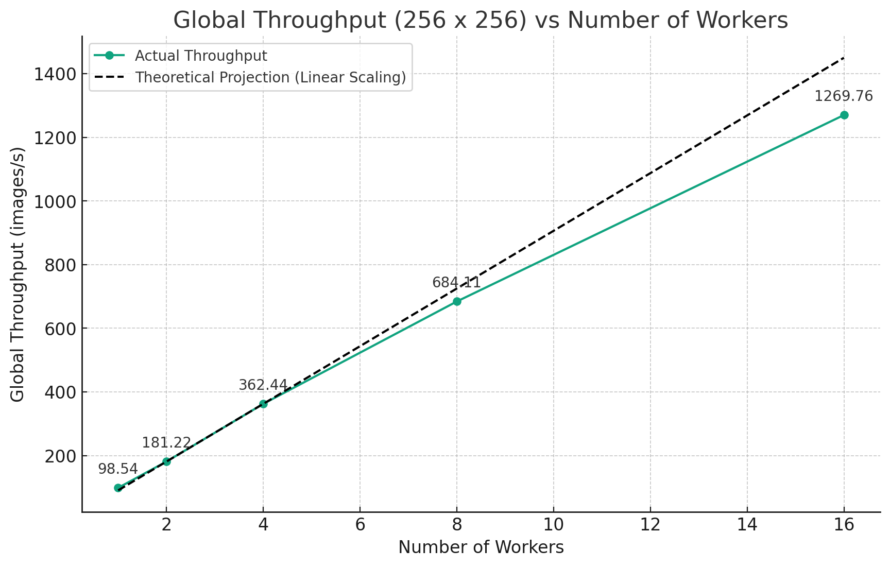
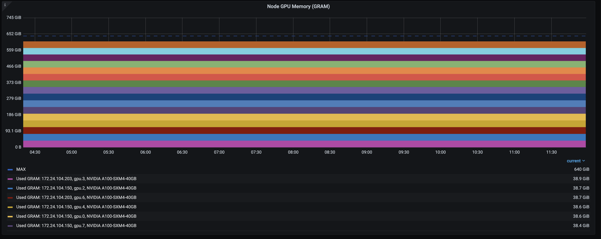
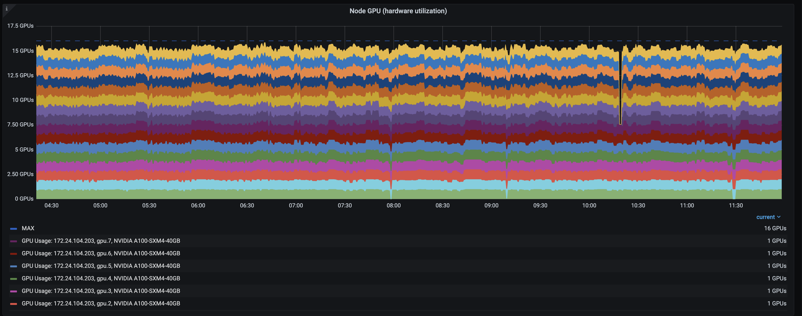
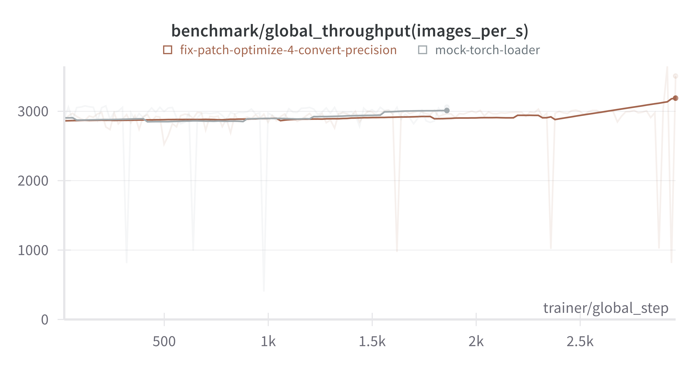
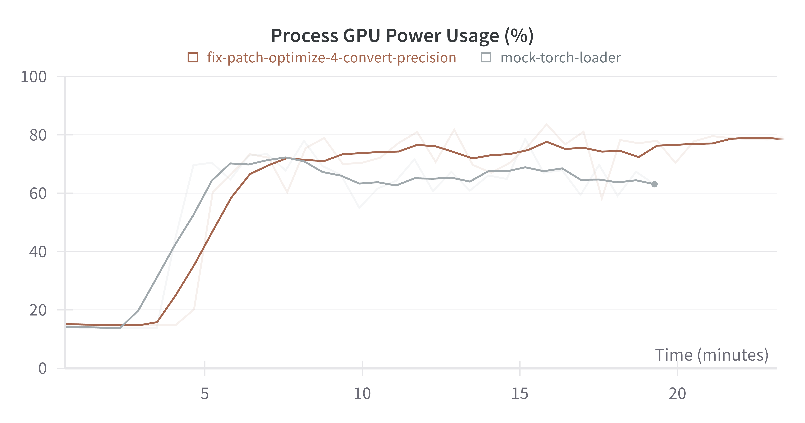
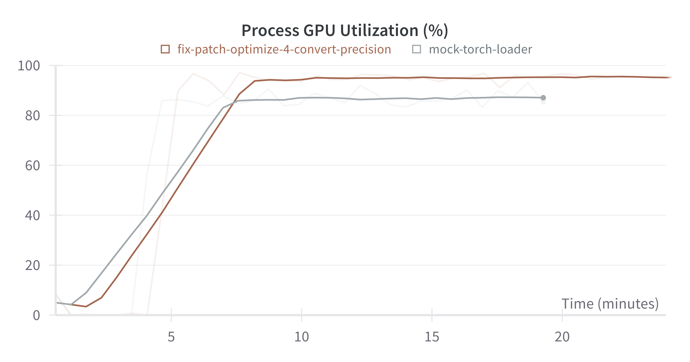

# Stable Diffusion Throughput Benchmark

## Pretrain SD-base with DDP

Given that the SD-base model (4.6G) is small enough to fully fit into a single A100-40G GPU. We first conduct experiments with DDP strategy and benchmarked the training throughput.

We measured the global throughput ranging from 1 to 16 workers with the same micro-batch size 32, gradient accumulation step of 1. The above graph shows that the training workload achieves near-linear acceleration.

**GPU Memory Usage**

**GPU Utilization**

The training process efficiently utilized up to 95% of the GPU memory and achieved close to 100% GPU utilization.

**EFA Support** 

Elastic Fabric Adapter (EFA) is a network interface for Amazon EC2 instances that enables running applications requiring high levels of inter-node communications at scale on AWS. It greatly reduced the communication overhead and can achive higher throughput for distributed training. This feature has been automatically supported on Anyscale Platform. 

Resolution | Strategy | Global Throughput (images/s) | Accumulated Speedup
-- | -- | -- | --
256 x 256 | DDP | 1075 | 1.0x
512 x 512 | DDP | 264  | 1.0x 
256 x 256 | DDP + EFA | 1269 | 1.18x
512 x 512 | DDP + EFA | 474 | 1.86x

## Training with FSDP

Although we can use DDP for Stable Diffusion training, since the model itself can be fit into a single A100-40G GPU. We still noticed that the GPU power usage is relatively low, indicating that the training speed is bounded by GPU memory.

Therefore, we leverage FSDP to shard the optimizer state and gradients across all workers, so that each GPU can accommodate larger batch sizes. Specifically, we use the `SHARD_GRAD_OP` mode (ZeRO-2), which gather partial gradients and update a shard of model parameters on each device, then gather the full updated parameters. It has the same inter-GPU communication volume as DDP, but has much lower GPU memory usage.

Resolution | Strategy | Global Throughput (images/s) | Accumulated Speedup
-- | -- | -- | --
256 x 256 | FSDP + EFA | 1925 | 1.79x
512 x 512 | FSDP + EFA | 667 | 2.52x

## `torch.compile`

`torch.compile` is the latest method introduced in 2.0 to speed up the PyTorch code. torch.compile makes PyTorch code run faster by JIT-compiling PyTorch code into optimized kernels. The significant speedup mainly comes from reducing Python overhead and GPU memory read/writes. We applied torch.compile on top of Torch FSDP, and achieved even accumulated 2.7x throughput improvement.

### Result:
Resolution | Strategy | Global Throughput (images/s) | Accumulated Speedup
-- | -- | -- | --
256 x 256 | FSDP + EFA + torch.compile | ~2900 | 2.70x
512 x 512 | FSDP + EFA + torch.compile | ~800 | 3.03x

We further compare Ray Data(brown) to an ideal simulation torch dataloader(gray), which initializes random input tensors and then feeds into the model. We have achieved comparable throughput as well as higher GPU power usage and utilization.

